# F1 Penalty Analysis: An ETL Pipeline for FIA Documents

This project automates the collection, structuring, and analysis of FIA stewards' decisions for the Formula 1 World Championship (2022–2025). It employs an end-to-end ETL (Extract, Transform, Load) pipeline that scrapes over 3,500 PDF documents from the FIA's dynamic website, converts them to text, and uses Large Language Models (LLMs) to extract structured data into a clean, analyzable format.

---
##  Features

* **Automated Web Scraping**: Uses **Selenium** to navigate the JavaScript-rendered FIA documents page, expanding all event panels to access penalty documents.
* **Bulk PDF Downloading**: Employs **BeautifulSoup** and **Requests** to parse the page source and download all relevant PDF files, intelligently organizing them into `year/grand_prix` folders.
* **PDF-to-Text Conversion**: Leverages **pdfplumber** to accurately extract raw text content from the thousands of downloaded FIA documents.
* **LLM-Powered Data Annotation**: Utilizes **LangChain** with two different LLMs (**Ollama with LLaMA 3.2** and **Google's Gemini 2.0**) to parse unstructured text and extract 18+ incident attributes into a structured JSON format.
* **Robust ETL Pipeline**: An end-to-end workflow with robust error handling, retry logic, data validation, and a clear, scalable folder structure for managing multi-year motorsport data.
* **Exploratory Data Analysis (EDA)**: Includes a script to perform initial data quality assessment on the final dataset using **Pandas**.

---
##  Project Architecture & Workflow

The project is structured as a sequential ETL pipeline. Each stage produces an output that serves as the input for the next stage, creating a clear and repeatable workflow.


---
##  Directory Structure

The project uses a structured directory to separate source code from data at various stages of processing.

```
.
├── data/
│   ├── pdfs/                 # Raw PDF files downloaded by the scraper
│   │   ├── 2022/
│   │   │   └── bahrain_grand_prix/
│   │   │       └── ... .pdf
│   │   └── ...
│   ├── raw_text/             # Text files extracted from PDFs
│   │   ├── 2022/
│   │   │   └── bahrain_grand_prix/
│   │   │       └── ... .txt
│   │   └── ...
│   └── annotations/          # Final structured data
│       └── annotated/
│           ├── 2022_annotations.csv
│           └── ...
├── src/                      # All source code
│   ├── 01_scraper.py
│   ├── 02_pdf_to_text.py
│   ├── 03a_annotator_ollama.py
│   ├── 03b_annotator_gemini.py
│   └── 04_data_cleaner.py
├── requirements.txt          # Project dependencies
└── README.md
```

---
##  Setup and Installation

1.  **Clone the Repository**:
    ```bash
    git clone <repository-url>
    cd <repository-name>
    ```

2.  **Prerequisites**:
    * Python 3.9+
    * Google Chrome browser installed.
    * **ChromeDriver**: Ensure `chromedriver` is installed and compatible with your Chrome version. Selenium should handle this automatically in recent versions, but manual installation may be required.
    * **(Optional) Ollama**: If using the local LLM, install [Ollama](https://ollama.com/) and pull the LLaMA 3.2 model:
        ```bash
        ollama pull llama3.2
        ```

3.  **Create a Virtual Environment**:
    ```bash
    python -m venv venv
    source venv/bin/activate  # On Windows, use `venv\Scripts\activate`
    ```

4.  **Install Dependencies**:
    ```bash
    pip install -r requirements.txt
    ```

5.  **API Keys (for Gemini)**:
    If using `03b_annotator_gemini.py`, set your Google AI Studio API key as an environment variable named `GOOGLE_API_KEY`.

---
##  How to Run the Pipeline

Execute the scripts from the `src/` directory in sequence.

### **Step 1: Scrape PDF Documents**

This script launches a Chrome browser, navigates to the FIA documents page, expands all race weekend panels, and downloads every linked PDF into the `data/pdfs` directory.

```bash
python src/01_scraper.py
```

### **Step 2: Convert PDFs to Text**

This script iterates through the downloaded PDFs, extracts the text content, and saves it to corresponding `.txt` files in the `data/raw_text` directory.

```bash
python src/02_pdf_to_text.py
```

### **Step 3: Annotate Text Data**

Choose one of the annotator scripts to process the raw text files. The script will invoke an LLM to extract structured data and save it to a CSV file in `data/annotations/annotated`. The scripts automatically skip files that have already been processed.

* **Option A (Local LLM with Ollama)**:
    *Ensure the Ollama application is running.*
    ```bash
    python src/03a_annotator_ollama.py
    ```

* **Option B (Google Gemini API)**:
    *Ensure your `GOOGLE_API_KEY` is set.*
    ```bash
    python src/03b_annotator_gemini.py
    ```

### **Step 4: Perform Data Quality Analysis**

This script loads the generated CSV into a Pandas DataFrame and prints a summary, including column types, missing value ratios, and sample data to help assess the quality of the LLM's output.

```bash
python src/04_data_cleaner.py
```

---
##  Scripts Documentation

### `01_scraper.py`

This script automates the extraction of PDF documents from the FIA's website. It uses Selenium to handle the dynamic, JavaScript-heavy nature of the site where content is loaded on-demand.

#### **Logic Flowchart**


### `02_pdf_to_text.py`

A straightforward utility script that recursively scans the input directory for PDF files and uses the `pdfplumber` library to convert them into plain text, preserving the directory structure.

#### **Logic Flowchart**


### `03a_annotator_ollama.py` & `03b_annotator_gemini.py`

These scripts are the core of the "Transform" stage. They read raw text, submit it to an LLM via LangChain, and parse the structured JSON output. They are designed to be resilient, with retry logic for network or JSON decoding errors, and can resume processing if interrupted.

The Gemini version (`03b`) includes more refined logic for checking previously processed files and cleaning the model's output.

#### **Logic Flowchart**



```mermaid
flowchart TD
    A[Start] --> B(Initialize LangChain with LLM and Prompt);
    B --> C(Check CSV for already processed files);
    C --> D(Create a set of processed filenames);
    D --> E(Get a list of all .txt files in the input folder);
    E --> F(Filter out processed files to get a to_process list);
    F --> G{Loop through files in to_process list};
    G -- For each file --> H(Read text content from file);
    H --> I{Invoke LLM Chain w/ Retry Logic};
    I -- Success --> J(Clean and Parse JSON response);
    J --> K(Add source_file name to each record);
    K --> L(Append new records to output CSV);
    L --> M(Wait/Cooldown period);
    M --> G;
    I -- Failure after all retries --> G;
    G -- After loop --> N[🎉 End: All files processed];
```

### `04_data_cleaner.py`

A utility script for Exploratory Data Analysis (EDA). It loads the final annotated CSV file and provides a high-level overview of the dataset's structure, completeness, and content.

#### **Logic Flowchart**


---
##  Data Schema & EDA Insights

The final dataset contains the following 18 columns, as defined by the LLM prompt:

| Column Name                  | Data Type | Description                                                    |
| ---------------------------- | --------- | -------------------------------------------------------------- |
| `type_of_document`           | `string`  | The official classification of the document.                   |
| `year`                       | `integer` | The year of the championship season.                           |
| `grand_prix`                 | `string`  | The name of the Grand Prix event.                              |
| `description`                | `string`  | A brief, one-sentence summary of the incident or decision.     |
| `session_type`               | `string`  | The session in which the event occurred (e.g., "Race", "FP1"). |
| `track`                      | `string`  | The name of the circuit, if mentioned.                         |
| `lap_number`                 | `integer` | The lap number of the incident.                                |
| `turn_number`                | `string`  | The turn number of the incident.                               |
| `safety_car_or_vsc_involved` | `string`  | Whether a Safety Car or VSC was active.                        |
| `penalty_given`              | `string`  | The specific penalty issued by the stewards.                   |
| `type_of_incident`           | `string`  | A classification of the incident (e.g., "Causing a collision").|
| `was_contact_made`           | `string`  | Whether physical contact occurred between cars.                |
| `immediate_advantage_gained` | `string`  | Whether an unfair advantage was gained.                        |
| `drivers_involved`           | `string`  | A list of drivers involved in the incident.                    |
| `teams_involved`             | `string`  | A list of teams involved in the incident.                      |
| `rule_violated`              | `string`  | The specific FIA regulation article that was breached.         |
| `decision_notes`             | `string`  | The stewards' justification or reasoning for their decision.   |
| `source_file`                | `string`  | The original `.txt` filename from which the data was extracted.|

### **Initial Findings**

The output from `04_data_cleaner.py` reveals key characteristics of the dataset:
* **High Sparsity**: Fields like `lap_number`, `turn_number`, and `penalty_given` have many missing values. This is expected, as many documents are procedural (e.g., "Car Display Procedure," "Curfew Report") and do not relate to on-track incidents with penalties.
* **Data Quality**: The LLM occasionally produces malformed data, such as the nested JSON object seen in the sample `df.head()` output. This highlights an area for future improvement, such as refining the prompt or adding a Pydantic validation layer.
* **Rich Text Fields**: Columns like `decision_notes`, `description`, and `rule_violated` contain valuable text data that can be used for deeper qualitative analysis or NLP tasks.
